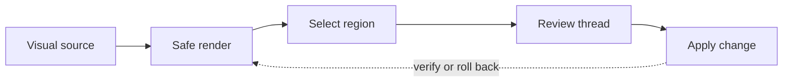

# Launch Readiness Review

Review Copilot sample deck for launch, support, and demo readiness.

---

## Why now

- Docs teams are receiving more generated drafts.
- Reviewers need rendered context before line-level source context.
- Support needs clear handoff language before launch.
- Agents need bounded comments that map back to documents, routes, and components.

---

## What Commentary demonstrates

1. Rendered Markdown review.
2. Static HTML report review.
3. Draft and Brainstorming Reviews.
4. Live Preview element comments.

---

## Annotate a dashboard region

Activate visual annotation, zoom into the dashboard, and select the blocked timeline item, a critical risk cell, or an aging-items bar.

---

## Annotate a source-backed workflow

Select the ownership handoff between Render and Review or the dashed rollback path. SVG source remains available in Raw.

---

## Review the lifecycle

---

## Launch gates

| Gate | Owner | State |
| --- | --- | --- |
| Support FAQ reviewed | Support | In review |
| Static HTML report approved | Product | Ready |
| GitHub Pages Live Preview embeds | Engineering | Needs validation |
| Demo reset manifest current | Growth | Pending reset |

---

## Demo narrative

1. Open a Markdown PR and review the rendered launch brief.
2. Move to the HTML migration report and inspect Preview plus Raw.
3. Open the Live Preview sample and comment on a billing control.
4. Show Draft and Brainstorming Reviews as agent-ready app-native records.

---

## Risks to discuss

- GitHub Pages routes must serve real app content at `/`, `/settings/billing`, `/usage`, and `/checkout`.
- The Live Preview SDK must load without exposing secrets.
- Demo comments should sound like real implementation feedback.

---

## Repeated occurrence check

This is the same SVG source used earlier. A marker created here should stay on this occurrence rather than appearing on both slides.

---

## Decision slide

Launch when rollback ownership, support FAQ, and sample demos are all ready.
