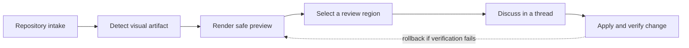

# Launch readiness review

## Executive summary

Review Copilot is ready for a controlled rollout to documentation-heavy teams that already use Commentary for rendered Markdown reviews. The launch should emphasize that reviewers start from the rendered artifact, then move to raw, diff, provider, or presentation views only when those tools answer a specific question.

The strongest launch story is not "another AI review bot." It is a review loop where generated documents, support handoffs, and app-preview comments stay readable enough for humans while agents receive bounded context they can act on.

## Launch decision

Ship to the first three design partners after support receives the fallback language, the docs team verifies the customer FAQ, and product confirms that Pro-preview features remain usable during the no-billing phase.

| Decision area | Current state | Launch requirement |
| --- | --- | --- |
| Rendered Markdown review | Ready | Keep rendered view as the default PR entry point. |
| Static HTML review | Ready with sandbox language | Support must explain why scripts are blocked. |
| Live Preview Review | Needs final demo validation | GitHub Pages sample must load in Commentary and expose SDK status. |
| Draft and Brainstorming Reviews | Ready for preview | Resettable samples must show realistic agent handoff comments. |

## Visual review walkthrough

Activate visual annotation, drag a rectangle around a specific part of an image or diagram, and submit the normal review comment. Use Fit and zoom controls to inspect detail without turning the review into a drawing tool.

### Operations dashboard

Annotate the blocked red timeline item, the critical cells in the risk matrix, or the aging panel that needs an explicit owner.


### Source-backed workflow

The SVG remains available in Raw while Preview supports region comments. Try annotating the dashed rollback route or the ownership handoff between Render and Review.


The same source appears again below. A comment on this occurrence should not place a marker on the occurrence above.


### Mermaid lifecycle



The same diagram is also available as a [standalone Mermaid artifact](../diagrams/release-flow.mmd) so Raw and Preview behavior can be reviewed independently.

## Reviewer experience

Reviewers should see a document-first workspace with file navigation, compact review state, and comments tied to the text they are actually reading. The raw diff is still available, but it should feel like a supporting tool instead of the main surface.

```yaml
launch_gate:
  owner: product
  required_checks:
    - support_faq_reviewed
    - live_preview_sample_embeds
    - demo_reset_manifest_current
    - rollback_owner_named
```

## Rollback plan

If the rollout exposes broken anchors, confusing share access, or provider sync failures, disable the feature flag for the affected organization. Keep existing review threads available, keep provider comments intact, and move active reviewers back to standard rendered Markdown review until the affected workflow is repaired.

Support should capture the review route, provider, surface type, and latest refresh state. Do not copy raw private repository URLs, customer Markdown, access tokens, or screenshots into telemetry.

## Open review notes

- Confirm the rollback owner is named in customer-facing copy.
- Add one screenshot of the rendered review shell to the FAQ.
- Verify the GitHub Pages Live Preview sample renders inside Commentary before the reset workflow publishes a new share link.
- Make sure support can explain why raw diffs remain available but secondary.
- Check that every demo route uses representative content rather than fixture-only prose.
